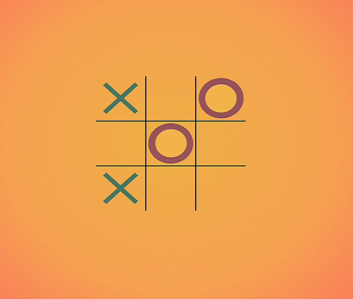

# tiktaktoe

## Description: 
Tic Tac Toe Game which automatically switches players and prevents repeats of mark placements. It also has a stylzed reset button which allows the user to begin a new game.

# Purpose:
This project was based on a tutorial by Web Dev Simplified. I did it (with some changes) because I needed to practice writing functions relating to mathmatical formulas and wanted exposure to some different CSS uses. 

# Future Improvements: 
1. Refactor the dispaly to show more history.  
2. Add "Dark Mode" toggle

